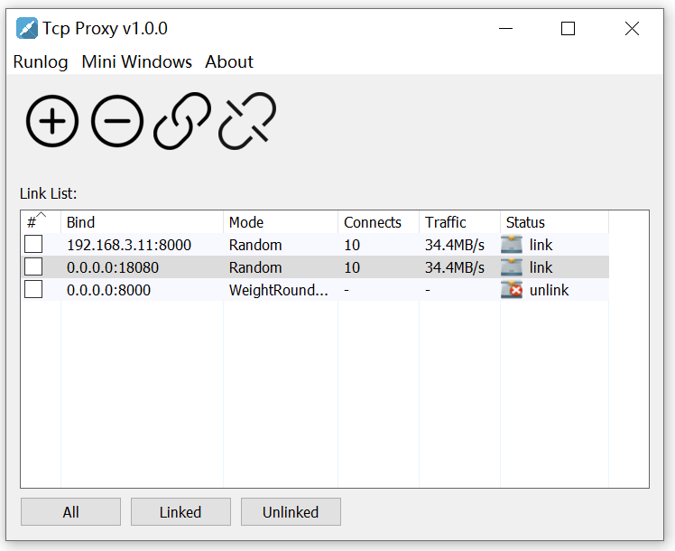
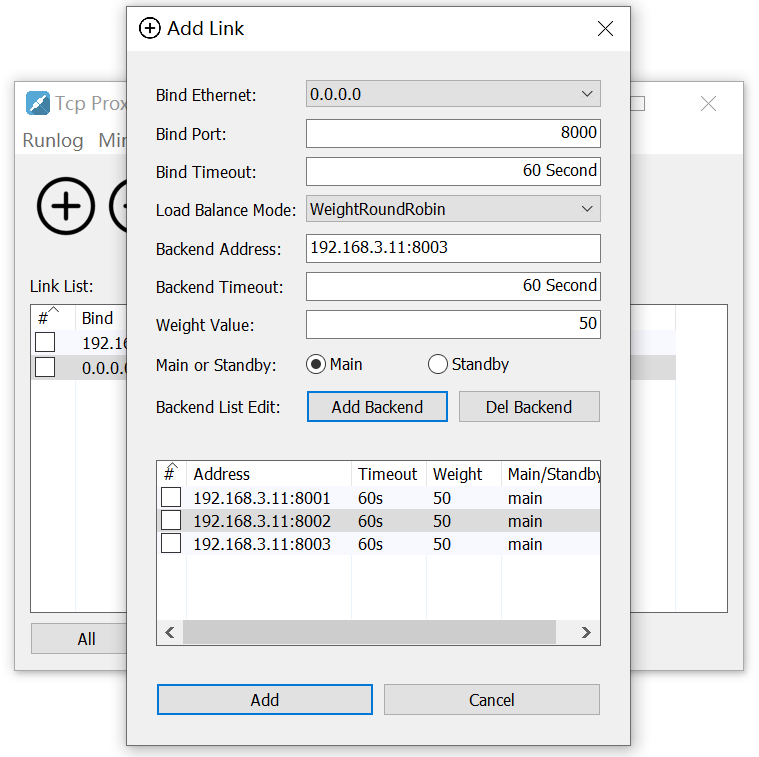

# tcpproxy
- support windows desktop
- support multiple load balance modes
- support real-time status display

[](https://sourceforge.net/projects/tcpproxy-for-windows/files/latest/download)

[](https://sourceforge.net/projects/tcpproxy-for-windows/files/latest/download)


## Build Step

1. Install tools
```
go install github.com/akavel/rsrc@latest
go install github.com/GeertJohan/go.rice@latest
go install github.com/GeertJohan/go.rice/rice@latest
```
2. Clone code
```
git clone https://github.com/linimbus/tcpproxy-windows.git
```
3. Build code
```
cd tcpproxy-windows
.\build.bat
```

## Samples

### Main windows



### Add tcp protocal link



### Double click the link to view the details


